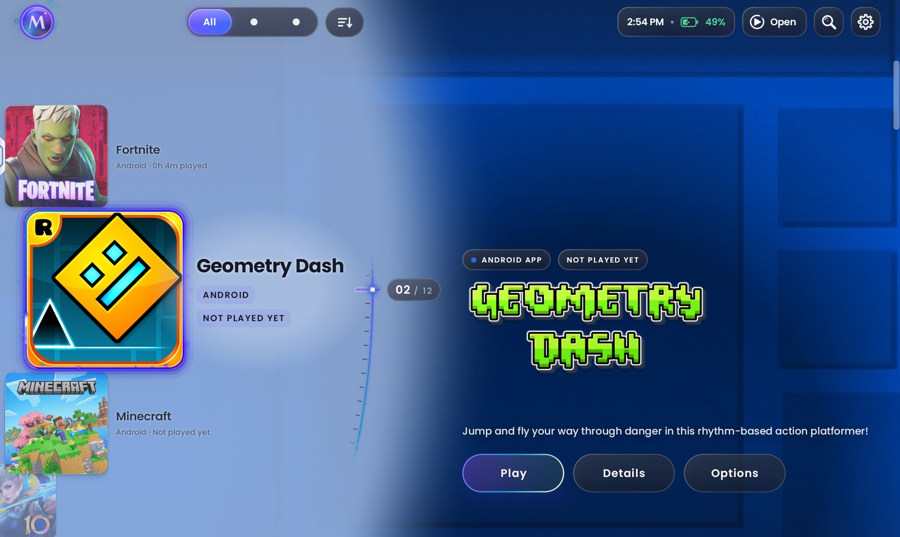
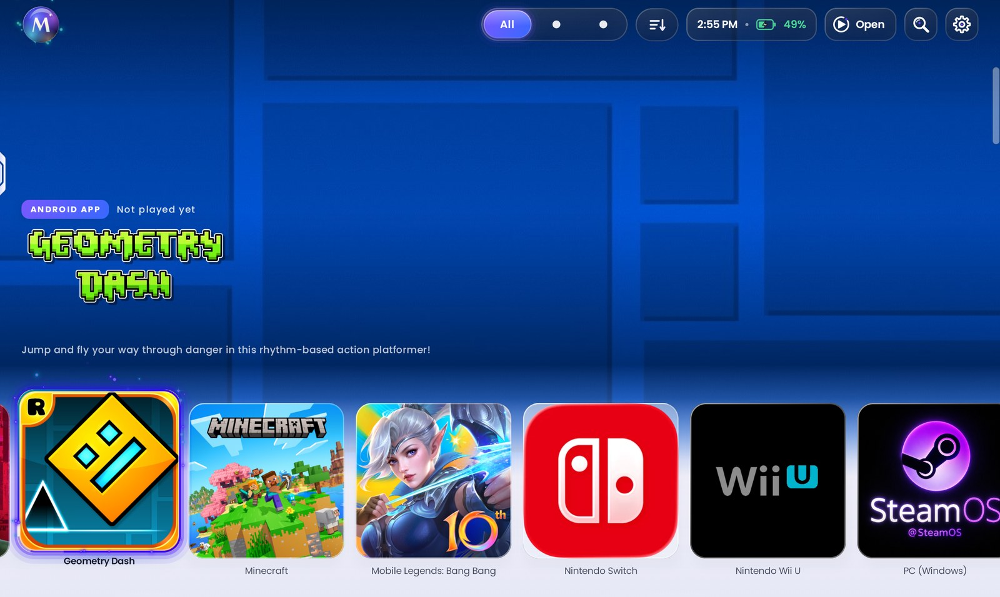
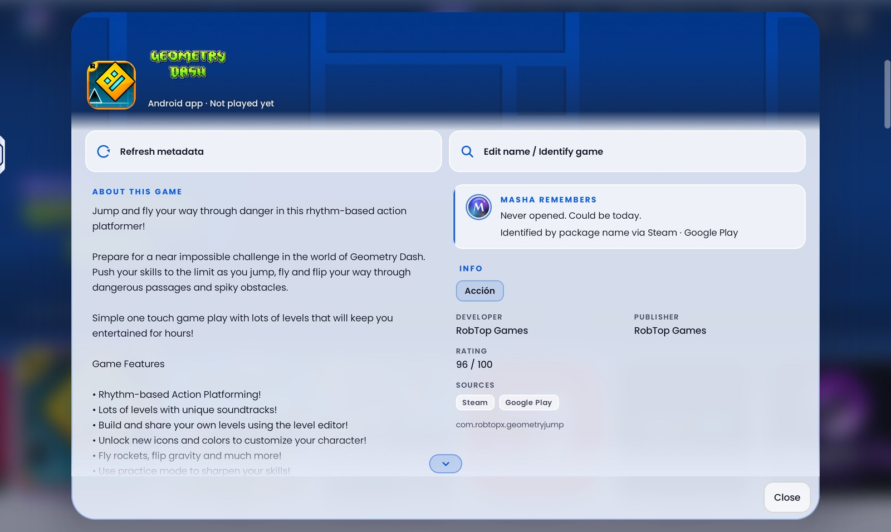
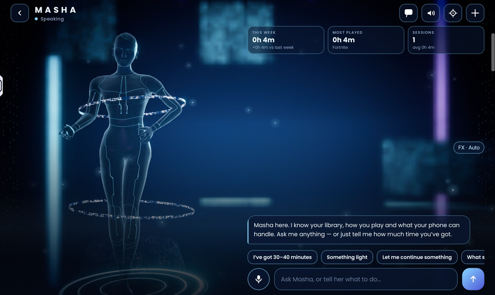
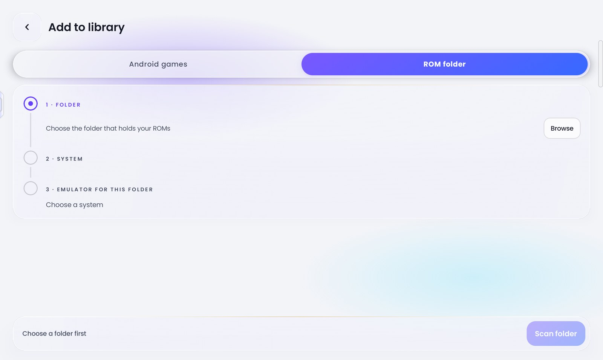
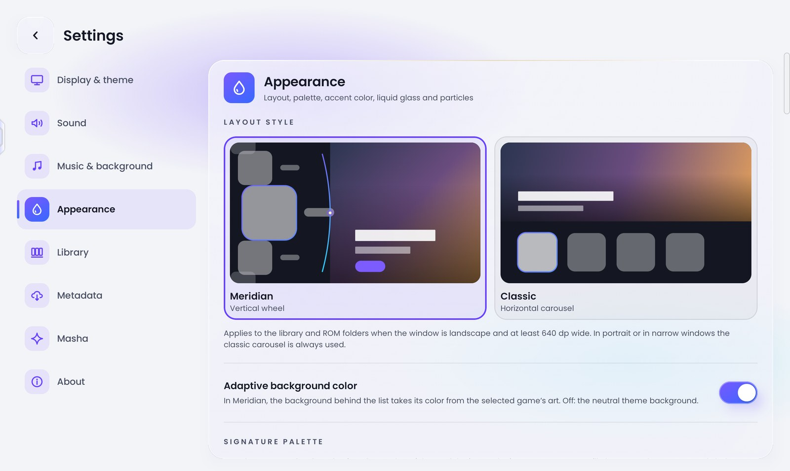
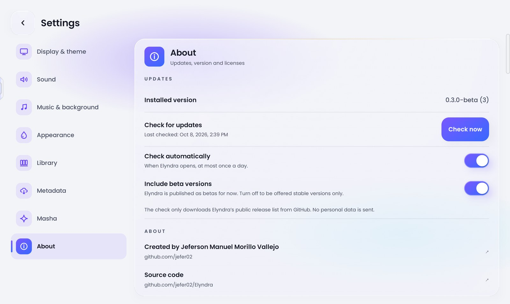
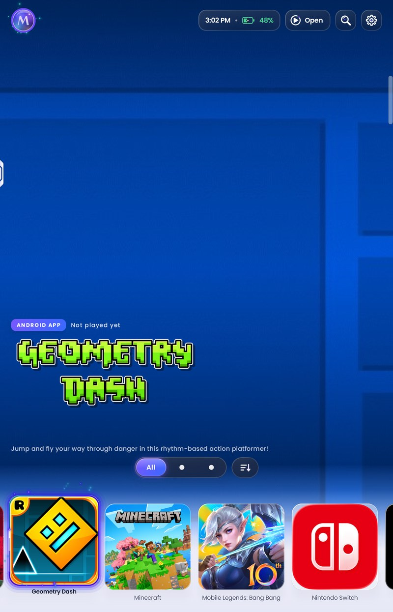

# Elyndra

**A console-style game launcher for Android that puts your Android games and emulator ROMs in one library, built for gamepads.**

[](https://github.com/jefer02/Elyndra/releases)
[](LICENSE)
[-3ddc84)](app/build.gradle.kts)



Elyndra **only indexes and launches games, it never emulates anything**: each
ROM is handed to the emulator you picked for its folder, with that emulator's
exact intent.

## Features

- **One library for everything.** Installed Android games and ROM folders
  live side by side, with filters (All / Android / Emulators), sorting and
  search.
- **Two layouts.** *Meridian*, a vertical wheel with a large hero (landscape),
  and *Classic*, a horizontal carousel (always used in portrait and narrow
  windows).
- **Built for gamepads.** The whole app works with a D-pad and sticks: Xbox,
  PlayStation, Switch Pro, generic and built-in handheld controllers, and TV
  remotes. Touch works everywhere too.
- **About 130 emulator profiles** with the exact intent of each emulator
  (component, action, extras), based on ES-DE's Android configuration,
  including RetroArch cores, Switch, Wii U, PlayStation 2/4, PSP and Windows
  PC games through Winlator-style runtimes. If the chosen emulator is missing,
  Elyndra offers to install it or pick another one.
- **ROM folders through the Storage Access Framework**, with no storage
  permission. The system is detected from the folder name; multi-track discs
  and PS3 folders are grouped correctly.
- **Automatic metadata.** Cover art, logos, screenshots, descriptions, dates,
  genres and achievements from ScreenScraper, IGDB, SteamGridDB and
  RetroAchievements (your own accounts, entered in Settings and stored
  encrypted), plus key-less sources (Google Play and Steam store pages,
  libretro thumbnails). You choose the source priority.
- **On-device translation** of game descriptions with ML Kit, downloaded per
  language on demand.
- **Real play time.** With optional usage access, the time the game was really
  in the foreground; otherwise, from launch until you come back.
- **Masha, the built-in assistant.** A 3D holographic avatar with lip-sync and
  facial expressions, an on-device natural voice (64-bit devices), chat and
  voice input. She picks the emulator that runs each game best on *this*
  device, remembers what and how you play, reviews the library (duplicates,
  missing discs, odd names) and plans short sessions ("I've got 30–40
  minutes"). See [Masha and the AI key](#masha-and-the-ai-key).
- **Look and feel.** Liquid-glass interface, signature color palettes, accent
  colors, selection glow and particles, an animated intro, optional video or
  image background, UI sounds and music.
- **Home-screen widget** and occasional Masha reminders.
- **Six languages:** English, Spanish, Portuguese, French, German and
  Japanese, switchable without restarting.
- **In-app updates** from GitHub Releases (see below).

## Screenshots

| | |
|---|---|
|  |  |
| Classic layout | Game details |
|  |  |
| Masha | Add a ROM folder |
|  |  |
| Appearance settings | Updates and About |

<p align="center">
  
  <br><sub>Portrait</sub>
</p>

Screenshots taken on a Lenovo Legion Y700 tablet. Game names, logos and cover
art belong to their owners.

## Download and install

1. Open the [Releases page](https://github.com/jefer02/Elyndra/releases) and
   download the APK for your device:
   - `…-arm64-v8a.apk` for almost every current phone, tablet and handheld;
   - `…-universal.apk` if you are not sure (bigger, works everywhere).
2. Open the APK. Android asks you to allow installing apps from the app you
   used to open it (browser or file manager): turn on **Allow from this
   source** and go back.
3. If Google Play Protect asks to scan the app, you can let it scan, or open
   **More details** to install without scanning.

### Updates

Elyndra checks GitHub Releases by itself when it opens, at most once a day,
and offers new versions with their release notes. Choose **Update** and it
downloads the right APK for your device, verifies its SHA-256 checksum and
opens Android's install dialog. The first time, Android asks you to allow
Elyndra to install apps. You can also check by hand, turn the automatic check
off, or choose whether beta versions are offered, in
**Settings → About → Updates**. The check only downloads the public release
list from GitHub; no personal data is sent.

Updates install over the existing app only when both are signed with the same
key, so builds you compile yourself (debug) can't be updated from Releases.

## Requirements

- Android 8.0 (API 26) or later. Tested mostly on Android 15.
- Masha's natural voice needs a 64-bit device and a one-time download of about
  145 MB. Elsewhere, Masha uses the system text-to-speech voice.
- A gamepad is optional.
- Internet is only needed for metadata, Masha's online AI, translations and
  updates. Everything else works offline.

## Build from source

You need JDK 17 and the Android SDK (compileSdk 35).

```bash
./gradlew assembleDebug        # build
./gradlew installDebug         # install on a connected device
./gradlew testDebugUnitTest    # unit tests
```

Optional keys go in `local.properties` at the project root, which is ignored
by git and must never be committed. Only the names are listed here:

| Key | What for |
|---|---|
| `sdk.dir` | Android SDK path (Android Studio writes it) |
| `masha.apiKey` | DeepSeek API key for Masha's online AI. Without it, Masha runs offline |
| `masha.model` | Chat model (optional, defaults to `deepseek-chat`) |
| `masha.baseUrl` | API base URL (optional, e.g. your own backend) |
| `screenscraper.devId`, `screenscraper.devPassword` | ScreenScraper developer credentials |
| `screenscraper.softname` | Registered software name (optional) |

Users' own service accounts (ScreenScraper, IGDB, SteamGridDB,
RetroAchievements) and their own DeepSeek key are entered inside the app and
stored encrypted with an Android Keystore key.

How to publish a version that the in-app updater picks up:
[docs/RELEASING.md](docs/RELEASING.md).

## Project structure

A single Gradle module (`:app`), Kotlin and Jetpack Compose, Hilt, Room and
WorkManager. The main packages are:

| Package | What it holds |
|---|---|
| `data/` | Library repository, Room database, settings, encrypted secrets, emulator and system profiles |
| `domain/` | Pure Kotlin logic (Masha's planning, emulator ranking, curation), tested on the JVM |
| `launch/` · `library/` | Intent planning and launching, SAF scanning, installed apps |
| `metadata/` | Metadata service clients, hashing, image cache, translation |
| `masha/` · `ui/masha/` | Masha's AI, tools, memory and offline mode; 3D avatar, voice and lip-sync |
| `update/` | In-app updates from GitHub Releases |
| `ui/` | Compose screens, controllers and the "Elyndra Console" design system |

More in [`docs/`](docs/):
[ARCHITECTURE.md](docs/ARCHITECTURE.md) (layers, data model, flows, privacy),
[UI_DESIGN.md](docs/UI_DESIGN.md) (design system),
[MASHA.md](docs/MASHA.md) (3D avatar),
[MASHA_VOICE.md](docs/MASHA_VOICE.md) (voice),
[MASHA_LIPSYNC.md](docs/MASHA_LIPSYNC.md) (lip-sync) and
[RELEASING.md](docs/RELEASING.md) (publishing). Most of the internal docs are
written in Spanish.

## Masha and the AI key

Masha's free-form conversation uses DeepSeek. The key comes from
`local.properties` (`masha.apiKey`) at build time, and each user can set their
own in **Settings → Masha** (stored encrypted). With no key, no network or the
AI turned off, Masha keeps working offline: plans, lists, launches and stats
come from your local data; only free-form chat is lost.

Only titles, systems, play time, device state, Masha's memories and the
conversation are sent to DeepSeek; never file paths, folders, account names
or credentials. Any key compiled into an APK can be extracted, so a public
build should route the AI through its own backend (`masha.baseUrl`).

## Roadmap

- A shelf for Masha's lists and arcs right in the library (today they live in
  the chat).
- AI-written ambient suggestions with daily caching.
- Instrumented tests for Room migrations and Compose.
- An own backend for the AI key.
- Splitting the app into Gradle modules and giving each screen its own
  ViewModel.
- Optional weekly summary and an encrypted library backup.

## Credits

Elyndra builds on the work of many projects: AndroidX and Jetpack Compose,
Kotlin, Hilt, OkHttp, Coil, SceneView and Filament, ONNX Runtime, ML Kit,
ES-DE's emulator configuration, the Supertonic voice model, CMUdict, MPFB2 and
the MakeHuman assets, and the Poppins and Cinzel fonts. The full list, with
licenses, is in [THIRD_PARTY_NOTICES.md](THIRD_PARTY_NOTICES.md) and in the
app under **Settings → About → Open-source licenses**.

## License

Copyright © 2026 Jeferson Manuel Morillo Vallejo. **All rights reserved.**

The source code is public on GitHub for reading only. You may install and use
the official releases for personal, non-commercial use. Copying, modifying,
redistributing or creating derivative works requires written permission. See
[LICENSE](LICENSE). Third-party components keep their own licenses.

## Author

Created by [Jeferson Manuel Morillo Vallejo](https://github.com/jefer02).
