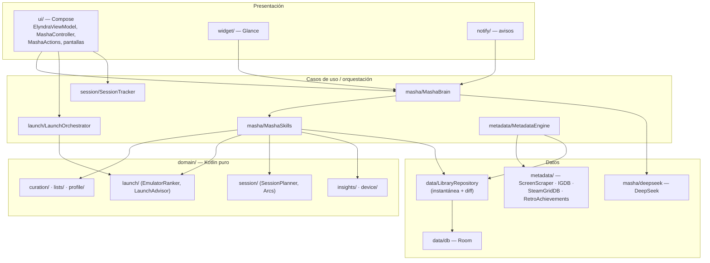
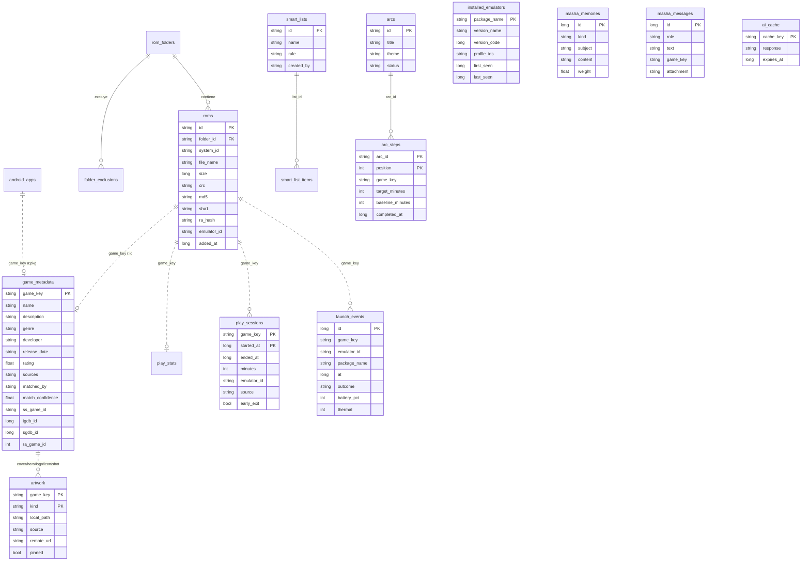
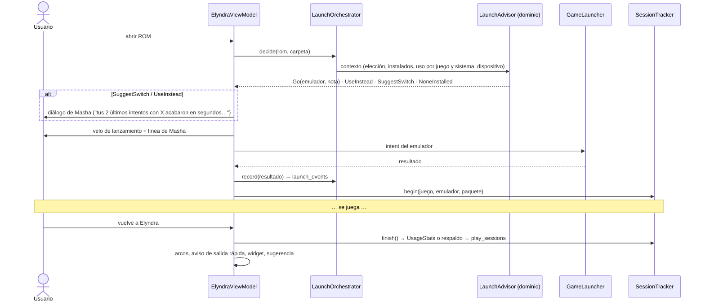
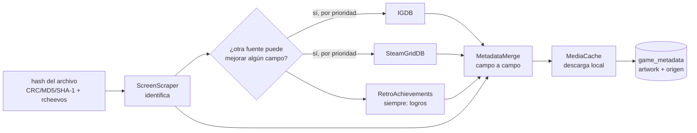
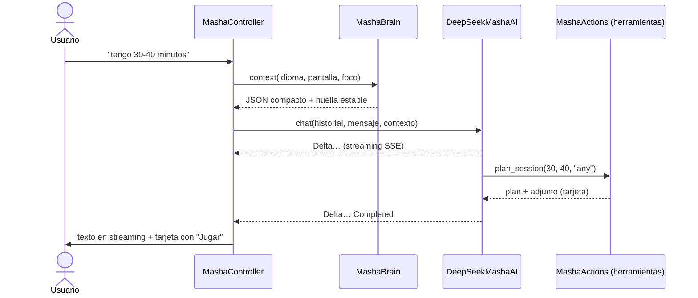

# Elyndra — Arquitectura

Elyndra es un lanzador de juegos y ROMs para Android. **No emula nada**: indexa
carpetas de ROMs (SAF) y juegos Android instalados, y entrega cada ROM al
emulador externo que corresponda (Eden, NetherSX2/AetherSX2, DuckStation,
PPSSPP, RetroArch, Redream, GameHub, Winlator…) con el intent exacto de ese
emulador.

**Masha** es la protagonista: la inteligencia que orquesta la experiencia. No
es un chat lateral; está en el lanzamiento, en la biblioteca, en los
metadatos, en la pantalla de inicio y en los avisos. El chat existe, pero es
una puerta más.

---

## 1. Capas y paquetes

Un solo módulo Gradle (`:app`) organizado por capas de Clean Architecture.



| Paquete | Qué hay | Depende de Android |
|---|---|---|
| `domain/` | Lógica de Masha: perfiles vivos, clasificación de emuladores, decisión de lanzamiento, revisión de la biblioteca, listas, minisesiones, arcos, sugerencias | **No** (se prueba en la JVM) |
| `masha/` | Contrato `MashaAI`, implementación DeepSeek, prompt, herramientas, contexto, caché, memoria, Masha sin conexión | Solo `MashaConfig` (Keystore) |
| `data/` | `LibraryRepository` (instantánea en memoria), Room (`data/db`), ajustes, secretos cifrados | Sí |
| `launch/` | Perfiles de emuladores (~130), `LaunchPlanner` (puro), `GameLauncher` (intents), `LaunchOrchestrator`, inventario de emuladores | Sí |
| `metadata/` | Clientes de servicios, hashes (rcheevos), `MetadataEngine`, prioridad de fuentes, caché de imágenes | Sí |
| `session/` | `SessionTracker` (UsageStatsManager + respaldo) | Sí |
| `core/device/` | `DeviceStateMonitor` (batería, temperatura, red) | Sí |
| `work/` · `widget/` · `notify/` | WorkManager, widget Glance, avisos | Sí |
| `di/` | Módulos Hilt | Sí |
| `ui/` | Compose: pantallas, controladores, componentes | Sí |

**Inyección:** Hilt. `ElyndraApplication` es `@HiltAndroidApp` y sigue exponiendo
`app.library`, `app.settings`… para el código anterior; el código nuevo recibe
sus dependencias por constructor. `MashaAI` se enlaza a `DeepSeekMashaAI` en
`di/MashaModule.kt`: cambiar de proveedor es cambiar esa línea.

**Por qué un solo módulo (por ahora):** la app ya tenía ~20 000 líneas en
`:app` y trabajo de interfaz en curso. Partirla en módulos a la vez que se
introducían Room, Hilt y Masha habría mezclado dos cambios grandes. El paquete
`domain/` ya no depende de Android, así que extraerlo a `:core:domain` es mover
carpetas (fase 3).

---

## 2. Modelo de datos (Room)

La interfaz trabaja contra una **instantánea en memoria** (`Library`) que
cambia de forma síncrona; `LibraryRepository` la persiste con un pequeño
retardo y `RoomLibraryStore` escribe **solo las filas que cambian**
(`LibraryDiff`, que descarta por identidad lo que no se tocó). La primera vez
se importa el antiguo `files/library.json` en una sola transacción y se aparta
como `library.json.migrated`.



- **Clave de juego** (`r:<id>` / `a:<paquete>`): metadatos, imágenes, tiempo y
  sesiones cuelgan de ella porque un juego puede ser de dos tablas distintas.
  El borrado en cascada de esas filas lo hace `LibraryDiff`.
- **Artwork** guarda ruta local, **servicio de origen** (`ss`, `igdb`, `sgdb`,
  `ra` o `local`), URL original y si está fijada a mano (el motor no la pisa).
- **Esquema versionado** en `app/schemas/` (exportado por Room). Sin
  `fallbackToDestructiveMigration`: un cambio de esquema sin migración falla en
  desarrollo en vez de borrar la biblioteca de nadie.

---

## 3. Flujos principales

### Lanzar una ROM



Reglas del orquestador (ver `LaunchAdvisor`): lo que elige el usuario
**manda**; Masha nunca cambia de emulador por su cuenta. Si el elegido no está
instalado y otro compatible sí, lo ofrece; si viene fallando con *ese* juego y
otro le ha ido bien, lo propone antes de lanzar. Sin elección, lanza con el
mejor clasificado.

**"Mejor en este dispositivo"**: un lanzador no puede medir FPS, pero sí lo que
los delata. Sesiones largas suman; salidas en menos de 3 minutos y
lanzamientos fallidos restan; la lista recomendada del sistema (conocimiento de
la comunidad) es el punto de partida (`EmulatorRanker`).

### Metadatos y arte



1. **Identificación**: hash → ScreenScraper (`jeuInfos`, `jeuRecherche` si no
   casa) y RetroAchievements (hash rcheevos o título). Cada fuente anota cómo
   reconoció el juego (`hash`, `name`, `fuzzy`) y con qué confianza.
2. **Prioridad elegida por el usuario** (Ajustes → Metadatos): un orden para
   textos y otro para imágenes. Cada campo sale de la primera fuente de la
   lista que lo tenga, y una fuente solo se consulta si puede mejorar algún
   campo que nadie de más prioridad haya resuelto (`MetadataMerge.wanted`).
3. **Caché local** en `files/media/<hash de la clave>/`, con marca de tiempo en
   el nombre (Coil nunca enseña una versión vieja). Lo elegido a mano queda
   fijado.
4. **Automático**: al añadir juegos y, una vez al día, `MetadataSyncWorker`
   (wifi, batería no baja, tandas de 40 juegos). **Manual**: Ajustes, menú de
   cada juego o pidiéndoselo a Masha.
5. **Respaldo elegante**: un servicio que falla (credenciales, cupo, red) se
   deja de usar en esa pasada sin parar las demás; lo que no se encuentra se
   queda con la carátula procedural del diseño; Masha cuenta qué falta.

### Conversación con Masha



Sin clave, sin red o con la IA apagada, `OfflineMasha` entiende por palabras
clave (es/en/pt/fr/de) lanzar, planear, recomendar, estadísticas, listas,
metadatos, revisión y arcos, y lo resuelve con **las mismas capacidades**
(`MashaSkills`) que usa la IA.

---

## 4. Masha en cada punto

| Punto | Qué hace Masha | Dónde |
|---|---|---|
| Biblioteca | Bocadillo junto a su botón con la sugerencia del momento (seguir con un juego, siguiente paso del arco, nunca abiertos, carátulas que faltan, revisión, calor…) | `MashaInsights` → `MashaBubble` |
| Lanzamiento | Elige emulador, avisa de batería/temperatura, recuerda la última sesión, propone cambiar si uno falla | `LaunchOrchestrator` → velo |
| Vuelta de jugar | Cierra pasos de arco, detecta salidas repetidas y lo dice en una línea | `ElyndraViewModel.afterSession` |
| Ficha del juego | "Masha recuerda": última sesión y emulador, duración típica, si el emulador va bien, cómo se identificó | `MashaMemoryBlock` |
| Metadatos | Cuenta lo que falta, lo descarga si se lo piden, respeta la prioridad | `update_metadata`, sugerencias |
| Chat | Conversa y actúa con 22 herramientas reales | `MashaScreen` |
| Pantalla de inicio | Widget con su línea y uno o dos juegos para ahora | `widget/MashaWidget` |
| Avisos | Como mucho uno cada 3 días, nunca de noche, silencioso | `notify/MashaNudgeWorker` |

---

## 5. Capa de IA

- **Contrato**: `MashaAI` (`chat` en streaming con herramientas, `complete`,
  `ping`). Eventos: `Delta`, `ToolStarted`, `ToolFinished`, `Completed`,
  `Failed`. Errores tipados (`MashaError`): sin clave, sin red, 401, 402 (sin
  saldo), 429, 5xx, petición mala, protocolo, demasiadas vueltas.
- **DeepSeek** (`deepseek-chat`, API compatible con OpenAI): `POST
  /chat/completions` con `stream: true`, `tools`, `tool_choice: auto`.
  El bucle de herramientas admite hasta 5 vueltas. Cancelar la conversación
  cancela la llamada HTTP al instante.
- **Prompt de sistema** (`MashaPrompt`, versionado): personalidad (inteligente,
  directa, algo sarcástica cuando encaja, siempre útil), qué es Elyndra, cómo
  leer el contexto, cuándo actuar (solo lo que se pide), reglas firmes (nada de
  piratería, ningún dato inventado, solo juegos de la biblioteca).
- **Contexto** (`MashaContextBuilder`): hora, dispositivo, pantalla y foco,
  biblioteca por sistema, horas de la semana, en curso / recientes /
  abandonados / nunca abiertos, lo que mejor va aquí, estado de arte y
  metadatos, revisión, arcos, emuladores instalados, recuerdos y una muestra del
  catálogo (máx. 120; para el resto, `find_games`).
- **Caché**, a dos niveles:
  1. `MashaCache` (Room + memoria): respuestas de consulta, 30 min, con clave =
     modelo + versión del prompt + idioma + pregunta + últimos turnos + huella
     estable del contexto. Nunca guarda respuestas que usaron herramientas que
     cambian algo.
  2. Prefijo de DeepSeek: el contexto va en el último mensaje (no en el de
     sistema), así sistema + herramientas + hilo se repiten y DeepSeek los sirve
     de su caché de disco.
- **Memoria**: `remember`/`forget` guardan preferencias en `masha_memories`; las
  más importantes viajan en el contexto. El hilo se guarda (60 mensajes).

**Herramientas**: `launch_game`, `find_games`, `get_game_profile`,
`suggest_emulator`, `set_game_emulator`, `plan_session`, `create_list`,
`open_list`, `create_arc`, `get_arcs`, `update_metadata`, `curation_report`,
`get_stats`, `remember`, `forget`, `filter_library`, `set_art`, `add_game`,
`remove_game`, `list_installed_apps`, `set_accent`, `set_dark_mode`.

---

## 6. Permisos y privacidad

| Permiso | Para qué | Cómo se pide |
|---|---|---|
| Carpetas (SAF) | Leer ROMs | El usuario elige cada carpeta; sin permiso de almacenamiento |
| `INTERNET`, `ACCESS_NETWORK_STATE` | Metadatos y Masha | Declarado |
| `POST_NOTIFICATIONS` | Progreso de metadatos y avisos de Masha | Una vez, al empezar |
| `FOREGROUND_SERVICE_DATA_SYNC` | Pasada completa de metadatos | Declarado |
| `PACKAGE_USAGE_STATS` | **Opcional**: tiempo de juego exacto | Solo desde Ajustes → Masha, en la pantalla del sistema |
| `<queries>` | Ver emuladores y juegos instalados | Declarado; **sin** `QUERY_ALL_PACKAGES` |

- **Sin root**, sin accesibilidad, sin superposición, sin leer otros archivos.
- **A DeepSeek solo viaja**: títulos, sistemas, tiempo de juego, estado del
  dispositivo, recuerdos y la conversación. **Nunca** rutas, URIs, carpetas,
  nombres de cuenta ni credenciales (hay una prueba que lo comprueba:
  `MashaLocalTest.theContextNeverCarriesPathsOrUris`).
- La IA se puede apagar (Ajustes → Masha): Masha sigue funcionando en local.
- "Olvidar todo lo que sabe Masha" borra recuerdos, hilo y caché.
- Credenciales cifradas con AES-GCM y una clave del Android Keystore;
  `allowBackup=false`.
- **La clave de DeepSeek va compilada** (`local.properties` → `BuildConfig`).
  Cualquier clave dentro de un APK se puede extraer: para publicar, la llamada
  debe pasar por un backend propio (basta con cambiar `masha.baseUrl`).

---

## 7. Plan por fases

**Fase 1 — MVP de Masha** ✅ *(hecho)*
Room + Hilt + WorkManager; importación de `library.json`; Masha con DeepSeek
(streaming, 22 herramientas, contexto, caché, memoria, modo sin conexión);
orquestador de lanzamientos con aprendizaje por dispositivo; sesiones con
UsageStats; revisión de la biblioteca, listas dinámicas, minisesiones y arcos;
prioridad de fuentes y origen de cada imagen; sugerencias ambientales, línea en
el velo, "Masha recuerda", widget y avisos; 180 pruebas unitarias.

**Fase 2 — Pulido**
- Estantería de listas y arcos en el propio carrusel (hoy viven en el chat).
- Identificar a mano un juego mal reconocido (elegir el resultado correcto).
- Voz de Masha para las sugerencias ambientales generada por la IA (con caché
  por día) además de las plantillas.
- Pruebas instrumentadas de Room (migraciones) y de Compose.
- Backend propio para la clave de DeepSeek.

**Fase 3 — Escala**
- Módulos Gradle: `:core:domain` (ya puro), `:core:data`, `:feature:masha`,
  `:feature:library`.
- Controladores de pantalla como ViewModels propios (hoy cuelgan de
  `ElyndraViewModel`).
- Resumen semanal opcional, copia de seguridad cifrada de la biblioteca.

---

## 8. Compilar y probar

```
./gradlew assembleDebug
./gradlew testDebugUnitTest
```

`local.properties` (no se versiona):

```
masha.apiKey=sk-...            # DeepSeek; sin clave Masha funciona en local
masha.model=deepseek-chat      # opcional
masha.baseUrl=https://api.deepseek.com   # opcional (p. ej. tu backend)
screenscraper.devId=...        # opcional
screenscraper.devPassword=...
```
